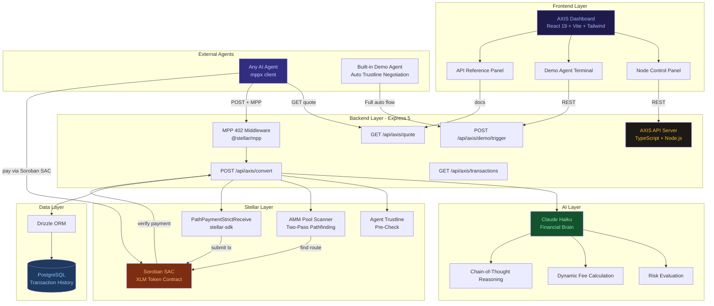
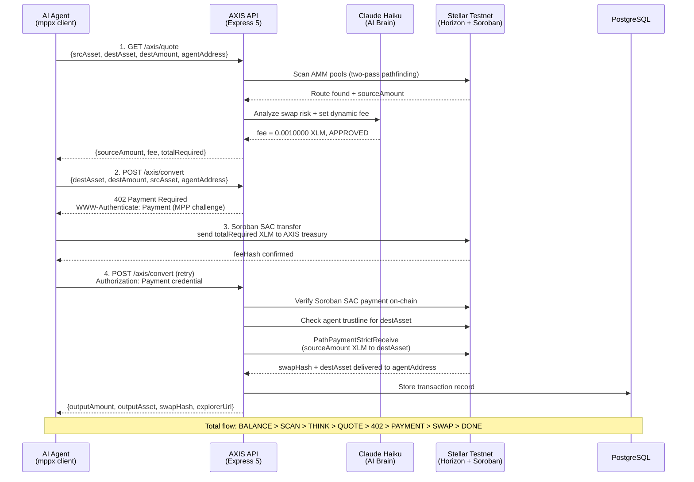

# AXIS: Autonomous X-border Interchange System

**Stellar Agents Hackathon** | Agent Liquidity Infrastructure on Stellar Testnet

---

## What is AXIS?

AXIS is an **open liquidity API for AI agents** built on Stellar Testnet. Any external agent can send XLM to AXIS via MPP (Machine Payments Protocol) and receive the target asset directly in their wallet. Fully autonomous, no human in the loop, fully on-chain.

```
External Agent
  ├── GET /axis/quote          -> receive price + totalRequired XLM
  └── POST /axis/convert       -> send totalRequired via MPP (Soroban SAC)
            |
            └── AXIS Treasury
                  ├── receive XLM (sourceAmount + fee)
                  ├── execute PathPaymentStrictReceive
                  └── deliver destAsset to agentAddress (on-chain)
```

**AI Brain** (Claude Haiku) analyzes every swap before execution: risk evaluation, dynamic fee setting, and chain-of-thought reasoning displayed live in the dashboard.

---

## Key Features

### MPP: Machine Payments Protocol (`@stellar/mpp`)
AXIS implements MPP draft-stellar-charge-00 as its payment gating layer. Every request to `/axis/convert` replies with HTTP **402 Payment Required** plus a `WWW-Authenticate: Payment` challenge. Agents use `mppx` to handle the full 402, pay via Soroban SAC, and retry cycle automatically.

### Quote-First Architecture
Agents call `/axis/quote` first to receive `totalRequired = sourceAmount + fee`. This value is used as the MPP charge amount. AXIS uses `sourceAmount` for the PathPayment and retains `fee` as revenue.

### Claude AI Financial Brain
Every swap is analyzed by Claude Haiku before execution:
- Risk and slippage evaluation
- Dynamic fee calculation (0.0005 to 0.005 XLM, AI-set per swap)
- Chain-of-thought reasoning shown live in the dashboard

### AMM Pool Discovery with Issuer Retry
AXIS runs a two-pass pathfinding strategy:
1. **Pass 1**: resolve asset via Horizon (`/assets?asset_code=X`, pick issuer with most accounts)
2. **Pass 2**: if not found, scan all AMM liquidity pools on testnet, extract issuer from pool, retry
3. If a route is found via pool issuer, execute immediately

### Agent Trustline Pre-Check
Before executing a swap, AXIS verifies that `agentAddress` has a trustline for `destAsset`. If not, AXIS returns a 400 error with step-by-step instructions to create the trustline using stellar-sdk.

### Smart Trustline Negotiation (Built-in Demo Agent)
The built-in Demo Agent includes automatic trustline negotiation. If it lacks a trustline for the destination asset, it creates one on-chain and sends the proof hash to AXIS before the swap continues.

### Dynamic Asset Pairs
Agents can specify any asset code. AXIS will:
- Discover the issuer via Horizon
- Scan AMM pools if needed
- Retry with the correct pool issuer automatically

### Persistent Transaction History
All transactions (successful and failed) are stored in PostgreSQL and displayed in the dashboard with direct links to Stellar Expert explorer.

### Open API for External Agents
Anyone can integrate AXIS into their AI agent. No whitelist, no API key required. Just pay the fee via MPP.

---

## Quick Start for External Agents

### 1. Fund your account on Stellar Testnet
```bash
curl "https://friendbot.stellar.org/?addr=YOUR_STELLAR_ADDRESS"
```

### 2. Create a trustline for the asset you want to receive (skip if XLM)
```typescript
import { TransactionBuilder, Operation, Asset, BASE_FEE } from "@stellar/stellar-sdk";

const tx = new TransactionBuilder(account, {
  fee: BASE_FEE,
  networkPassphrase: "Test SDF Network ; September 2015",
})
  .addOperation(Operation.changeTrust({
    asset: new Asset("USDC", "GBBD47IF6LWK7P7MDEVSCWR7DPUWV3NY3DTQEVFL4NAT4AQH3ZLLFLA5"),
  }))
  .setTimeout(30)
  .build();

tx.sign(agentKeypair);
await server.submitTransaction(tx);
```

### 3. Get a quote
```bash
curl "https://your-axis-url/api/axis/quote?srcAsset=XLM&destAsset=USDC&destAmount=1&agentAddress=YOUR_STELLAR_ADDRESS"
```

### 4. Integrate with mppx and execute the swap
```typescript
import { Mppx } from "mppx/client";
import { stellar } from "@stellar/mpp/charge/client";
import { Keypair } from "@stellar/stellar-sdk";

const agentKeypair = Keypair.fromSecret("S...");

// Step 1: Get quote
const quoteRes = await fetch(
  `https://your-axis-url/api/axis/quote?srcAsset=XLM&destAsset=USDC&destAmount=1` +
  `&agentAddress=${agentKeypair.publicKey()}`
);
const { quote } = await quoteRes.json();
// quote.totalRequired = "2.5010000" (sourceAmount + AXIS fee)

// Step 2: Set up MPP client
const mppxClient = Mppx.create({
  methods: [
    stellar.charge({
      keypair: agentKeypair,
      mode: "push",
      onProgress: (event) => {
        if (event.type === "challenge") {
          console.log("AXIS requires:", event.amount, "XLM");
        } else if (event.type === "paid") {
          console.log("Funds sent, tx:", event.hash);
        }
      },
    }),
  ],
});

// Step 3: Execute (handles 402, payment, and retry automatically)
const response = await mppxClient.fetch(`https://your-axis-url/api/axis/convert`, {
  method: "POST",
  headers: {
    "Content-Type": "application/json",
    "X-Axis-Fee": quote.totalRequired,
  },
  body: JSON.stringify({
    destAmount: "1",
    destAsset: "USDC",
    srcAsset: "XLM",
    agentAddress: agentKeypair.publicKey(),
  }),
});

const result = await response.json();
console.log("Received:", result.result.outputAmount, result.result.outputAsset);
// Received: 1 USDC
```

---

## API Endpoints

| Method | Path | Auth | Description |
|--------|------|------|-------------|
| `GET` | `/api/axis/status` | None | Node status, current fee, supported pairs |
| `GET` | `/api/axis/balance` | None | AXIS Treasury and Demo Agent balances |
| `GET` | `/api/axis/quote` | None | Price quote: sourceAmount, fee, totalRequired |
| `POST` | `/api/axis/convert` | MPP 402 | Execute swap, deliver destAsset to agentAddress |
| `POST` | `/api/axis/demo/trigger` | None | Full 8-step autonomous demo flow |
| `GET` | `/api/axis/transactions` | None | Transaction history (up to 50 records) |

<details>
<summary><strong>GET /api/axis/quote: full response schema</strong></summary>

Query parameters:
- `srcAsset`: source asset code (`XLM`, `USDC`, or `CODE:ISSUER`)
- `destAsset`: destination asset code
- `destAmount`: exact amount of destination asset to receive
- `agentAddress`: receiving agent's Stellar public key

```json
{
  "success": true,
  "quote": {
    "sourceAmount": "2.5000000",
    "fee": "0.0010000",
    "totalRequired": "2.5010000",
    "srcAsset": "XLM",
    "destAsset": "USDC",
    "destAmount": "1",
    "route": "XLM to USDC",
    "validUntil": "2026-04-11T18:10:00.000Z",
    "axisAddress": "GCXVRIXJGGPEBP76SVBEA2TGPPBJVZWU3Y2QIQH65GA7FFHTGIK4VHCD",
    "instructions": "Send totalRequired XLM via MPP to POST /api/axis/convert"
  }
}
```

</details>

<details>
<summary><strong>POST /api/axis/convert: request and response</strong></summary>

Request body (JSON):
```json
{
  "destAsset": "USDC",
  "destAmount": "1",
  "srcAsset": "XLM",
  "agentAddress": "GXXX..."
}
```

Required headers:
```
Content-Type: application/json
X-Axis-Fee: 2.5010000
Authorization: Payment <mppx sets this automatically>
```

Response:
```json
{
  "success": true,
  "conversion": {
    "inputAmount": "2.5000000",
    "outputAmount": "1.0000000",
    "route": "XLM to USDC",
    "hash": "abc123...",
    "explorerUrl": "https://stellar.expert/explorer/testnet/tx/abc123..."
  }
}
```

</details>

<details>
<summary><strong>POST /api/axis/demo/trigger: full response schema</strong></summary>

Runs the full 8-step autonomous flow using the built-in Demo Agent (no `agentAddress` required):

```json
{
  "destAsset": "CAT",
  "destAmount": "0.5",
  "srcAsset": "XLM"
}
```

Response includes `steps[]`, `brainDecision`, and `result` with `sourceAmount`, `fee`, `totalPaid`, `feeHash`, and `swapHash`.

```json
{
  "success": true,
  "steps": [
    { "step": "BALANCE", "status": "Balance checked" },
    { "step": "SCAN",    "status": "AMM pool route discovered" },
    { "step": "THINK",   "status": "Decision: APPROVED" },
    { "step": "QUOTE",   "status": "Swap quote received" },
    { "step": "402",     "status": "MPP Payment Required" },
    { "step": "PAYMENT", "status": "Agent funds sent to AXIS via Soroban SAC" },
    { "step": "SWAP",    "status": "PathPaymentStrictReceive executed" },
    { "step": "DONE",    "status": "CAT received" }
  ],
  "result": {
    "sourceAmount": "0.5000000",
    "fee": "0.0010000",
    "totalPaid": "0.5010000",
    "outputAmount": "0.5",
    "outputAsset": "CAT",
    "route": "XLM to CAT",
    "feeHash": "ded04ce8...",
    "swapHash": "c5fd1264...",
    "explorerUrl": "https://stellar.expert/explorer/testnet/tx/c5fd1264..."
  }
}
```

</details>

---

## Protocol Flow

<details>
<summary><strong>Expand: Full MPP payment flow (external agent)</strong></summary>

```
EXTERNAL AGENT                    AXIS
------------------------------------------------------------

1. GET /axis/quote            ->  return sourceAmount + fee + totalRequired
2. POST /axis/convert         ->  402 Payment Required
                              <-  WWW-Authenticate: Payment (MPP challenge)
3. Soroban SAC transfer       ->  agent sends totalRequired XLM to AXIS treasury
4. POST /axis/convert (retry) ->  Authorization: Payment <credential>
                                  AXIS verifies Soroban SAC payment on-chain
                                  AXIS checks agent trustline for destAsset
                                  AXIS executes PathPaymentStrictReceive
                              <-  destAsset arrives at agentAddress on-chain
5. Response                       { conversion: { hash, explorerUrl, outputAmount } }
```

</details>

---

## Demo Flow (8 Steps)

<details>
<summary><strong>Expand: What happens when POST /api/axis/demo/trigger is called</strong></summary>

AXIS runs the following steps fully autonomously using the built-in Demo Agent:

```
Step 1  BALANCE   Check Demo Agent balance, discover asset issuer via Horizon
Step 2  SCAN      Scan AMM pools, two-pass pathfinding with pool issuer retry
Step 3  THINK     Claude AI evaluates risk, sets dynamic fee, makes decision
Step 4  QUOTE     AXIS calculates sourceAmount needed, totalRequired = source + fee
Step 5  402       POST /axis/convert returns 402 + MPP challenge to Demo Agent
Step 6  PAYMENT   Demo Agent sends totalRequired XLM via Soroban SAC to AXIS treasury
Step 7  SWAP      AXIS executes PathPaymentStrictReceive on Stellar Testnet
Step 8  DONE      Confirm Demo Agent final balance + Stellar Expert explorer link
```

Each step is returned in the `steps[]` array of the response, with `status` and `detail` fields for full transparency.

</details>

---

## Stellar Testnet

| Item | Value |
|------|-------|
| Horizon | `https://horizon-testnet.stellar.org` |
| Network passphrase | `Test SDF Network ; September 2015` |
| XLM SAC (Testnet) | `CDLZFC3SYJYDZT7K67VZ75HPJVIEUVNIXF47ZG2FB2RMQQVU2HHGCYSC` |
| USDC issuer | `GBBD47IF6LWK7P7MDEVSCWR7DPUWV3NY3DTQEVFL4NAT4AQH3ZLLFLA5` |
| AXIS Treasury | `GCXVRIXJGGPEBP76SVBEA2TGPPBJVZWU3Y2QIQH65GA7FFHTGIK4VHCD` |
| Demo Agent | `GBOILRL4C5K74FLP4MJ27STY37ASSQPKOHOQ2UORZFYIG5FWLQHBFLDF` |

---

## Architecture

### System Architecture



### 8-Step Swap Flow (Sequence)



<details>
<summary><strong>Expand: Monorepo file structure</strong></summary>

```
artifacts/
├── api-server/               Express 5 backend (TypeScript)
│   └── src/
│       ├── routes/axis/
│       │   └── index.ts      All AXIS endpoints: /status, /quote, /balance,
│       │                     /convert, /demo/trigger, /transactions
│       ├── lib/
│       │   ├── stellar.ts        Stellar SDK helpers, keypair, trustline,
│       │   │                     checkAgentTrustline
│       │   ├── pathPayment.ts    PathPaymentStrictReceive and pathfinding
│       │   ├── liquidityPools.ts AMM pool scanner (two-pass)
│       │   ├── brain.ts          Claude AI (AXIS brain and Demo Agent brain)
│       │   ├── trustline.ts      Trustline negotiation (Demo Agent)
│       │   └── transactionStore.ts PostgreSQL persistence
│       └── middlewares/
│           └── mpp.ts        MPP 402 fee middleware (@stellar/mpp)
│
└── axis-dashboard/           React + Vite frontend (TypeScript)
    └── src/
        ├── pages/
        │   ├── home.tsx      Landing page (3 cards: Node, Demo, API Ref)
        │   ├── dashboard.tsx AXIS Node and Demo Agent terminal
        │   └── api-ref.tsx   API Reference panel
        └── components/dashboard/
            ├── node-pane.tsx Node control panel
            ├── demo-pane.tsx Demo Agent terminal
            └── api-pane.tsx  API Reference panel
```

</details>

---

## Tech Stack

| Layer | Technology |
|-------|------------|
| Runtime | Node.js 24 |
| Backend | Express 5 + TypeScript |
| Stellar SDK | `@stellar/stellar-sdk` |
| Payment Protocol | `@stellar/mpp` (MPP Stellar Charge, draft-stellar-charge-00) |
| MPP Client | `mppx` |
| AI Brain | Claude Haiku (`claude-haiku-4-5`) via Anthropic SDK |
| Database | PostgreSQL + Drizzle ORM |
| Frontend | React 19 + Vite + Tailwind CSS v4 |
| Monorepo | pnpm workspaces |
| Build | esbuild |

---

## Environment Variables

| Variable | Description |
|----------|-------------|
| `AXIS_SECRET_KEY` | AXIS Treasury secret key (auto-generates and funds via Friendbot if empty) |
| `DEMO_AGENT_SECRET_KEY` | Built-in Demo Agent secret key |
| `DATABASE_URL` | PostgreSQL connection string |
| `ANTHROPIC_API_KEY` | Claude API key (via Replit AI Integration) |
| `PORT` | Server port (set automatically by Replit) |

---

## Development

```bash
# Install dependencies
pnpm install

# Run API server (dev mode with hot reload)
pnpm --filter @workspace/api-server run dev

# Run dashboard (dev mode)
pnpm --filter @workspace/axis-dashboard run dev

# Build API server (production)
pnpm --filter @workspace/api-server run build

# Typecheck the entire monorepo
pnpm run typecheck

# Push DB schema
pnpm --filter @workspace/db run push
```
